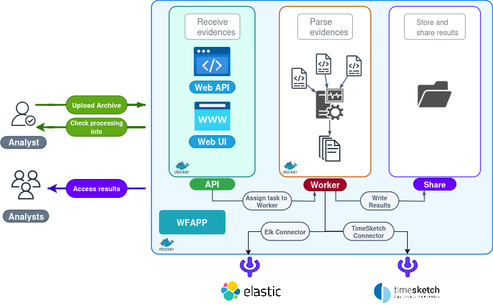

<p align="center">
  
</p>


---


# Windows Forensic Artefact Parser Project (WAPP) 💻

> A fast and simple Docker-based solution for parsing Windows forensic artifacts and generating human-readable results.


---

### 📌  Key Links

* **Documentation:** [Installation Guide](https://github.com/youhgo/WFAPP/blob/master/ressources/documentation/how_to_install.md) | [Usage Guide](https://github.com/youhgo/WFAPP/blob/master/ressources/documentation/how_to_use.md) | [Results Architecture](https://github.com/youhgo/WFAPP/blob/master/ressources/documentation/Explaining_the_results.md)
* **DFIR-ORC Configuration:** [Tutorial](https://github.com/youhgo/WFAPP/blob/master/ressources/documentation/configure_orc.md)
* **ELASTIC Connector:** Ongoing
* **TimeSketch Connector:** Ongoing
---

**Disclamer**: I'm not a professional dev and this tool is not secure by design.
Therefore, it is **ABSOLUTLY NOT** recommended to expose the API or Web UI to the internet.

### Working on : 
- Authentification System for Gui and API
- Ingest disk copy (VMDK, E01 etc) using only plaso and [**MaximumPlasoParser**](https://github.com/Xbloro/maximumPlasoTimelineParser)
- ELK (currently the ingest is ~fine with 0.01% of failed, but the results are not indexed the way i want)
- TimeSketch : Not a lot to do as the tool is already configured for plaso. Just setup.

## 🧐 What is WAPP?

WAPP is an all-in-one solution designed to provide a fast, simple, and reliable way to parse Windows artifacts (event logs, MFT, registry hives, and more).

The tool is designed to process archives from the [DFIR-ORC](https://github.com/dfir-orc) collection tool but is compatible with any archive containing raw artifacts, like the one from [Kape](https://www.kroll.com/en/services/cyber/incident-response-recovery/kroll-artifact-parser-and-extractor-kape).

### Key Advantages:

* **Fast:** Processes a 500MB archive in \~5 minutes (excluding Plaso).
* **Simple:** Easily installable with a single `docker compose up --build` command.
* **Effective:** Produces highly readable CSV files, allowing analysts to start investigations immediately.

---

## 🚀 How It Works

WAPP automates the forensic parsing workflow in a seamless pipeline:

1. **Ingestion:** Processes a DFIR-ORC archive or any archive containing raw artifacts.
2. **Parsing:** Parses all the collected evidence using a suite of powerful internal and external tools.
3. **Output:** Creates ultra-readable CSV files for quick analysis.
4. **Timeline Creation:** Ingests all evidence with Plaso to create a comprehensive timeline.
5. **Integration:** The timeline can be sent to Elastic using the integrated pipeline and a pipeline for TimeSketch is in development.

---

## 📈 Example Results

WAPP produces clear, actionable results by focusing on the most relevant information.

In this example, we can quickly identify key events like:
* Mimikatz and Cobalt Strike beacon usage.
* Backdoor and ransomware activity.
* Antivirus disabling.
* Compromised user connections.

```bash
 rg -i "2021-01-07\|03.(3|4|5)" user_logon_id4624.csv new_service_id7045.csv amcache.csv app_compat_cache.csv powershell.csv windefender.csv 
windefender.csv

2021-01-07|03:32:30|1116 - Detection|VirTool:Win32/MSFPsExecCommand|Severe|NT AUTHORITY\SYSTEM|Unknown|CmdLine:_C:\Windows\System32\cmd.exe /Q /c echo cd ^> \\127.0.0.1\C$\__output 2^>^&1 > C:\Windows\TEMP\execute.bat & C:\Windows\system32\cmd.exe /Q /c C:\Windows\TEMP\execute.bat & del C:\Windows\TEMP\execute.bat|Not Applicable
2021-01-07|03:33:13|1117 - Action|VirTool:Win32/MSFPsExecCommand|Severe|NT AUTHORITY\SYSTEM|Unknown|Remove
2021-01-07|03:35:44|1116 - Detection|HackTool:Win64/Mikatz!dha|High|BROCELIANDE\arthur|C:\Users\Public\beacon.exe|file:_C:\Users\Public\mimikatz.exe|Not Applicable

app_compat_cache.csv
2021-01-07|03:39:31|beacon.exe|C:\Users\Public\beacon.exe|e55e5b02ad40e9846a3cd83b00eec225fb98781c6f58a19697bf66a586f77672
2021-01-07|03:41:21|mimikatz.exe|C:\Users\Public\mimikatz.exe|e55e5b02ad40e9846a3cd83b00eec225fb98781c6f58a19697bf66a586f77672
2021-01-07|03:56:55|Bytelocker.exe|C:\Users\Public\Bytelocker.exe|e55e5b02ad40e9846a3cd83b00eec225fb98781c6f58a19697bf66a586f77672

powershell.csv
2021-01-07|03:37:03|600|powershell Set-MpPreference -DisableRealtimeMonitoring $true; Get-MpComputerStatus

new_service_id7045.csv
2021-01-07|03:32:30|7045|LocalSystem|%COMSPEC% /Q /c echo cd  ^> \\127.0.0.1\C$\__output 2^>^&1 > %TEMP%\execute.bat & %COMSPEC% /Q /c %TEMP%\execute.bat & del %TEMP%\execute.bat|BTOBTO

user_logon_id4624.csv
2021-01-07|03:31:26|4624|-|MSOL_0537fce40030|192.168.88.136|54180|3
2021-01-07|03:31:38|4624|-|arthur|192.168.88.137|54028|3
```

---

## 🛠️ Tool Architecture & Design

WAPP's architecture is built for simplicity and teamwork:

* **Dockerized:** The entire toolchain is containerized, making it incredibly easy to set up and run with a single command.
* **API-Driven:** The built-in web server provides an API for sending archives and checking the status of processing tasks.
* **Shared Results:** All results are stored in a shared folder, allowing any analyst with access to the share to review and analyze the data independently.
* **No bullSh*t:** No shitty GUI to interact with the results, only CSV/Json, so you can investigate the way you want.




The tool also includes a simple Web GUI for common tasks:
* Upload archives.
* Check logs and parsing status.
* Download the DFIR-Orc.exe binary.
* Stop running tasks.


---

## 🔗 External Tools & Resources

WAPP leverages the power of these fantastic open-source tools:

* [**PREFETCH PARSER**](http://www.505forensics.com)
* [**PLASO**](https://github.com/log2timeline/plaso)
* [**EVTX DUMP**](https://github.com/0xrawsec/golang-evtx)
* [**analyzeMFT**](https://github.com/rowingdude/analyzeMFT)
* [**regpy**](https://pypi.org/project/regipy/)
* [**YARP**](https://github.com/msuhanov/yarp)
* [**MaximumPlasoParser**](https://github.com/Xbloro/maximumPlasoTimelineParser)
