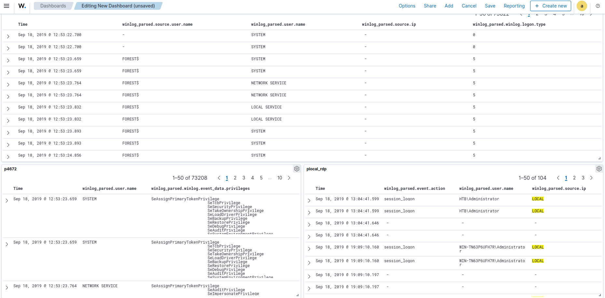
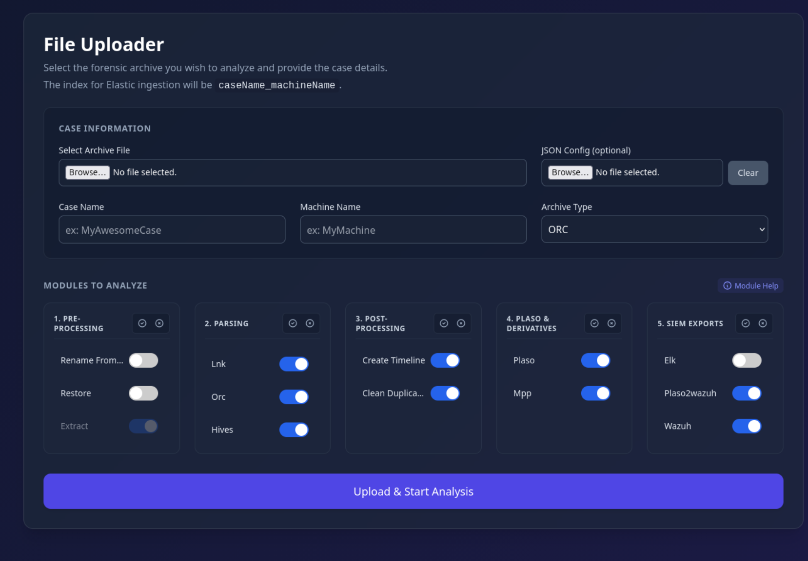

<p align="center">
 
</p>

# WFAPP - Windows Forensic Artifacts Parser Pipeline


WFAPP is a robust, modular, and extremely performant forensic pipeline designed to extract, parse, and normalize a wide range of Windows artifacts. It acts as an orchestrator that leverages community-driven open-source tools to extract raw data, before standardizing it into simplified, human-readable formats (CSV, JSONL).

> **Disclaimer:** I am not a professional developer, and this tool is not secure by design. Therefore, it is ABSOLUTELY NOT recommended to expose the API or Web UI to the internet.

---

## Features

- **Automated Pipeline**: Orchestrates forensic processing workflows with minimal configuration.
- **Wazuh/SIEM Ready**: Automatically standardizes parsed output for easy ingestion by Wazuh or other SIEM solutions.
- **Plug & Play Architecture**: Easily extendable. The community can drop a new parser and a new pipeline in the specific directories and the main Dispatcher will automatically load them.
- **Extremely Low Memory Footprint**: Uses a stream-based (`yield`) reading approach. WFAPP can parse files of several Gigabytes (like huge Amcache hives) without loading the entire file into RAM.

## Supported Artifacts

WFAPP parses the following forensic artifacts out-of-the-box:
- **Event Logs (.evtx)**
- **Windows Registry Hives (SAM, SYSTEM, SOFTWARE, NTUSER, etc.) & Amcache**
- **Web History (Chrome, Edge)**
- **Prefetch (.pf)**
- **System Info (WMI/DFIR-ORC outputs)**
- **Process Activity (Autoruns, Sysmon, AppCompatCache, etc.)**
- **Disk Activity (USN Journal, MFT)**
- **LNK Files (.lnk)**

---

## Installation & Usage

### 1. Requirements
Ensure you have the following dependencies installed:
- Python 3.9+
- Docker & Docker Compose (If using the Web UI / Wazuh stack)

### 2. Environment Configuration
Clone the repository and copy the example environment file:
```bash
git clone https://github.com/youhgo/WFAPP.git
cd WFAPP
cp .env.example .env
```
Edit the `.env` file to configure your paths and desired settings.

### 3. Usage (CLI)

WFAPP can be executed directly from the command line using the `APPEngine`.

```bash
cd APPEngine
python3 main.py -c /path/to/your/config.json -i /path/to/evidences -o /path/to/results
```

**Arguments:**
- `-c` : Path to your execution configuration (defining what to parse).
- `-i` : Input directory containing the raw forensic artifacts (e.g. collected via DFIR-ORC or Kape).
- `-o` : Output directory where the standardized CSV/JSONL results will be saved.

### 4. Running with the Web UI
To spin up the entire ecosystem (WFAPP API + Web interface + Wazuh dashboard), use the provided docker-compose stack:

```bash
docker-compose up -d
```
You can then access the Web UI at the port specified in your `.env`.

---

## Example Results

APP can send all the data to Wazuh/openSearch with built-in pipelines.
Some useful Dashboards are provided:
- Connection
- Process execution
- Persistences
- Timeline
- A lot more



For the PowerUser that wants to investigate using the command line, APP produces clear, actionable results by focusing on the most relevant information.

In this example, we can quickly identify key events like:
- Mimikatz and Cobalt Strike beacon usage.
- Backdoor and ransomware activity.
- Antivirus disabling.
- Compromised user connections.

```bash
rg -i "2021-01-07\|03.(3|4|5)" user_logon_id4624.csv new_service_id7045.csv amcache.csv app_compat_cache.csv powershell.csv windefender.csv 
windefender.csv

2021-01-07|03:32:30|1116 - Detection|VirTool:Win32/MSFPsExecCommand|Severe|NT AUTHORITY\SYSTEM|Unknown|CmdLine:_C:\Windows\System32\cmd.exe /Q /c echo cd ^> \\127.0.0.1\C$\__output 2^>^&1 > C:\Windows\TEMP\execute.bat & C:\Windows\system32\cmd.exe /Q /c C:\Windows\TEMP\execute.bat & del C:\Windows\TEMP\execute.bat|Not Applicable
2021-01-07|03:33:13|1117 - Action|VirTool:Win32/MSFPsExecCommand|Severe|NT AUTHORITY\SYSTEM|Unknown|Remove
2021-01-07|03:35:44|1116 - Detection|HackTool:Win64/Mikatz!dha|High|BROCELIANDE\arthur|C:\Users\Public\beacon.exe|file:_C:\Users\Public\mimikatz.exe|Not Applicable

app_compat_cache.csv
2021-01-07|03:39:31|beacon.exe|C:\Users\Public\beacon.exe|e55e5b02ad40e9846a3cd83b00eec225fb98781c6f58a19697bf66a586f77672
2021-01-07|03:41:21|mimikatz.exe|C:\Users\Public\mimikatz.exe|e55e5b02ad40e9846a3cd83b00eec225fb98781c6f58a19697bf66a586f77672
2021-01-07|03:56:55|Bytelocker.exe|C:\Users\Public\Bytelocker.exe|e55e5b02ad40e9846a3cd83b00eec225fb98781c6f58a19697bf66a586f77672

powershell.csv
2021-01-07|03:37:03|600|powershell Set-MpPreference -DisableRealtimeMonitoring $true; Get-MpComputerStatus

new_service_id7045.csv
2021-01-07|03:32:30|7045|LocalSystem|%COMSPEC% /Q /c echo cd ^> \\127.0.0.1\C$\__output 2^>^&1 > %TEMP%\execute.bat & %COMSPEC% /Q /c %TEMP%\execute.bat & del %TEMP%\execute.bat|BTOBTO

user_logon_id4624.csv
2021-01-07|03:31:26|4624|-|MSOL_0537fce40030|192.168.88.136|54180|3
2021-01-07|03:31:38|4624|-|arthur|192.168.88.137|54028|3
```

---

## Architecture & How It Works

1. **The Dispatcher (`dispatcher.py`)**: This is the heart of the engine. When the engine starts, the Dispatcher automatically scans the `modules/` folder for any class decorated with `@register_pipeline`. It automatically maps them to the appropriate configuration keys.
2. **The Pipelines (`modules/`)**: Pipelines act as the bridge between the raw files and the parsers. They decide *which* files should be parsed (using Regex).
3. **The Parsers (`parsers/`)**: Parsers implement a streaming `parse()` method using Python `yield`. They read a file line by line (or chunk by chunk), normalize the data into a standard Python dictionary, and instantly pass it back to the pipeline.
4. **The Sinks (`classes/BaseParser.py`)**: The Pipeline redirects the yielded dictionary to an Output Sink (`CsvOutputSink`, `JsonlOutputSink`, or `TextOutputSink`). The Sink appends the line to the disk on the fly, drastically reducing memory usage.

### Web GUI

The tool also includes a simple Web GUI for common tasks:
- Upload archives.
- Check logs and parsing status.
- Download the DFIR-Orc.exe binary.
- Stop running tasks.



---

## External Tools & Resources

APP leverages the power of these open-source tools:

- [PREFETCH PARSER](http://www.505forensics.com)
- [PLASO](https://github.com/log2timeline/plaso)
- [EVTX DUMP](https://github.com/0xrawsec/golang-evtx)
- [analyzeMFT](https://github.com/rowingdude/analyzeMFT)
- [regpy](https://pypi.org/project/regipy/)
- [YARP](https://github.com/msuhanov/yarp)
- [MaximumPlasoParser](https://github.com/Xbloro/maximumPlasoTimelineParser)

---

## Contributing and Documentation

- For information on writing new parsers, pipelines, or documenting plugins for the Web GUI, see the [DEVELOPER_GUIDE.md](ressources/documentation/DEVELOPER_GUIDE.md).
- For automating parsing tasks and programmatically interacting with the backend, see the [API_GUIDE.md](ressources/documentation/API_GUIDE.md).
- For a visual tour of the platform and an explanation of the web interface features, see the [GUI_GUIDE.md](ressources/documentation/GUI_GUIDE.md).
