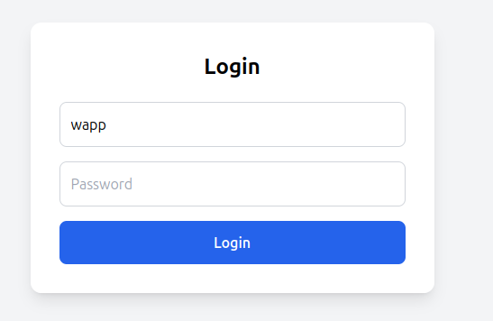
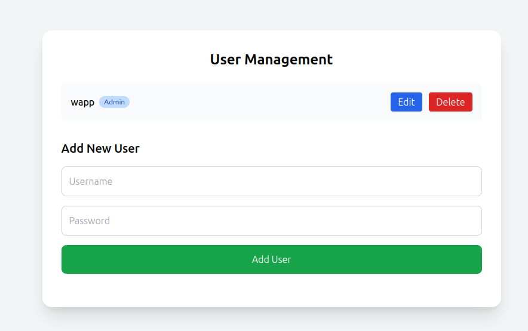
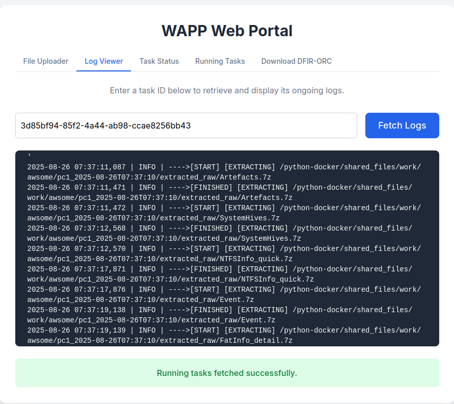
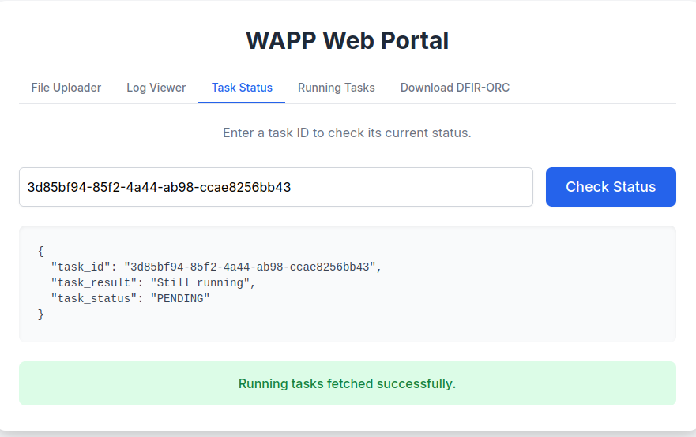
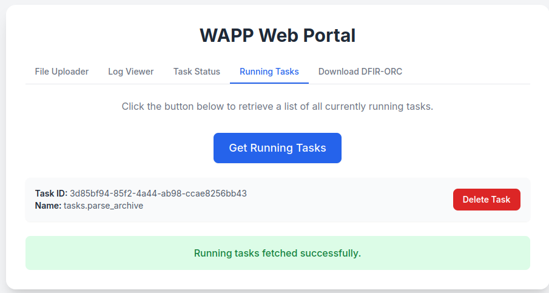
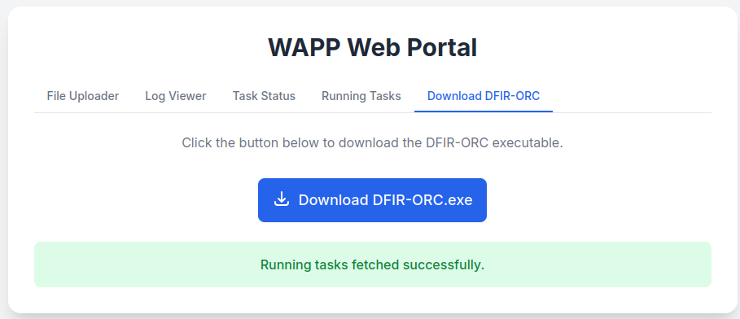

# How to Use WAPP

WAPP is simple to use thanks to its **Web GUI** and **REST API**.  
This guide covers both methods.

---

## 📌 Useful Links

* **WAPP Repository:** [Available here](https://github.com/youhgo/WFAPP)
* **Installation tutorial:** [Installation Guide](https://github.com/youhgo/WFAPP/blob/master/ressources/documentation/how_to_install.md)
* **Results explained:** [Results Architecture](https://github.com/youhgo/WFAPP/blob/master/ressources/documentation/Explaining_the_results.md)
* **DFIR-ORC Configuration:** [Tutorial](https://github.com/youhgo/WFAPP/blob/master/ressources/documentation/configure_orc.md)
---

## 🚀 Using the Web GUI

The default address for the GUI is:

```
https://wapp.localhost/login_page
```
<p align="center">
  
</p>

you will need to login. The default admin account is :
```
  user: wapp
  password : changeme
```

The interface provides **5 tabs**:

- **File Uploader** – Upload an archive you want to parse.  
- **Log Viewer** – Monitor parsing status in real time.  
- **Task Status** – Check the status of a specific task.  
- **Running Tasks** – View all running tasks and stop them if needed.  
- **Download DFIR-ORC** – Download a preconfigured, ready-to-use ORC collector.  


### Main Tab
<p align="center">
  
</p>

This Tab allows you to upload a collect archive. 
On the right side, you have the possibility to choose the parsers you want to execute.
You also have the possibility to use a default config file for artefacts.

Please read the [tutorial](Configure_WAPP.md) as an invalid configuration format might break the tool.

By uploading an archive, you will be provided with an ID,
it will be needed to check the tasks status and its associated logs.

You will be able to find it in the Running task tab if you lose it.

---

### Manage Users
<p align="center">
  
</p>
With an Admin account you can add and modify the users 

### Log Viewer

<p align="center">
  
</p>

This tabs allow you to see the logs associated with a parsing task and check if a parser failed or else.
You need to provide it's associated task id.

---

### task Status

<p align="center">
  
</p>

This tab allow you to check onb the status of a task.

---

### Running Tasks 

<p align="center">
  
</p>

This tab allows you to get all the running tasks and stop one if needed.

---
### Download DFIR-ORC

<p align="center">
  
</p>

This Tab allows you to download a already configured DFIR-Orc.exe collector and loaded with a config fully optimised.

---


## ⚡ Using the API

### Parsing an Archive

**Endpoint**  
```
POST /api/parse/parse_archive
```

**Parameters**  
- `file` – Archive file to parse  
- `json` – JSON string with case and machine name  

**Example JSON body:**

```json
{
  "caseName": "name_of_your_case",
  "machineName": "name_of_the_machine_analyzed"
}
```

**Example JSON body with custom parser config:**

```json
{
  "caseName": "name_of_your_case",
  "machineName": "name_of_the_machine_analyzed",
  "parser_config": {
      "disk": 1,
      "elk": 0,
      "evtx": 1,
      "hive": 1,
      "mft": 1,
      "mpp": 1,
      "network": 1,
      "lnk": 1,
      "plaso": 1,
      "prefetch": 1,
      "process": 1,
      "system_info": 1
  }
}
```

**Example JSON body with custom parser config and artefact config:**

Please read the [tutorial](Configure_WAPP.md) as an invalid configuration format might break the tool.

```json
{
  "caseName": "name_of_your_case",
  "machineName": "name_of_the_machine_analyzed",
  "parser_config": {
    "disk": 1,
    "...": "...",
    "system_info": 1
  },
  "artefact_config": {
    "...": {"...": ["..."]},
    "hives": {
      "NTUSER": ["NTUSER.DAT$"], 
      "...": ["..."],
      "SAM": ["SAM$"]
    },
     "...": {"...": ["..."]}
  }
}
```


**Example request with `curl`:**

First we need to login
```bash
curl -k -X POST \                                                                                                                                                                    60 ↵
-H "Content-Type: application/json" \
-d '{"username": "wapp", "password": "changeme"}' \
-c cookie_jar.txt \
https://wapp.localhost/api/login

```

```bash
curl -b cookie_jar.txt -X POST -k https://wapp.localhost/api/parse/parse_archive   -F file=@"/path/to/archive.7z"   -F json='{"caseName":"test", "machineName":"DesktopForest"}'
```

**Example response:**

```json
{
  "message": "Your archive has been send to queue",
  "taskId": "b16b2be6-0c04-4540-96e9-ab922c27b2f7",
  "statusUrl": "/api/get_task_status/b16b2be6-0c04-4540-96e9-ab922c27b2f7",
  "runLogUrl": "/api/running_log/b16b2be6-0c04-4540-96e9-ab922c27b2f7"
}
```

---

### Other API Endpoints

| Endpoint                         | Method | Description                                            | Authentication |
|----------------------------------|--------|--------------------------------------------------------|----------------|
| `/`                              | GET    | Health check – returns welcome message and server time | None           |
| `/api/get_task_status/<task_id>` | GET    | Get the status and result of a task                    | required       |
| `/api/running_log/<task_id>`     | GET    | Get the running log of a task                          | required       |
| `/api/get_running_tasks`         | GET    | Get all currently running tasks                        | required       |
| `/api/stop_task/<task_id>`       | POST   | Stop a single task by ID                               | required       |
| `/api/get_running_tasks_parse`   | GET    | Get only parser-related tasks                          | required       |
| `/api/get_parser_worker_name`    | GET    | Get the worker handling parsing tasks                  | required       |
| `/api/get_worker_details`        | GET    | Get Celery worker statistics                           | required       |
| `/api/download/dfir-orc`         | GET    | Download the DFIR-Orc.exe collector                    | required       |
| `/api/debug/list_resources`      | GET    | List contents of the resources directory (debug)       | required       |
| `/api/login`                     | POST   | 	Authenticates a user and starts a session.            | 	None          |
| `/api/logout`                    | POST   | 	Logs the current user out of their session.           | 	Required      |
| `/api/register`                  | POST   | 	Registers a new user.                                 | 	Admin only    |
| `/api/users`                     | GET	   | Lists all registered users.                            | 	Admin only    |
| `/api/users/<user_id>`           | PUT    | 	Updates an existing user's information.               | 	Admin only    |
| `/api/users/<user_id>`           | DELETE | 	Deletes a user.                                       | 	Admin only    |

---
## ✅ Summary

- Use the **Web GUI** for quick interaction and task monitoring.  
- Use the **API** for automation and integration into larger workflows.  
- Always keep track of the `taskId` returned when submitting an archive—it is required to check status, view logs, or stop tasks.  
