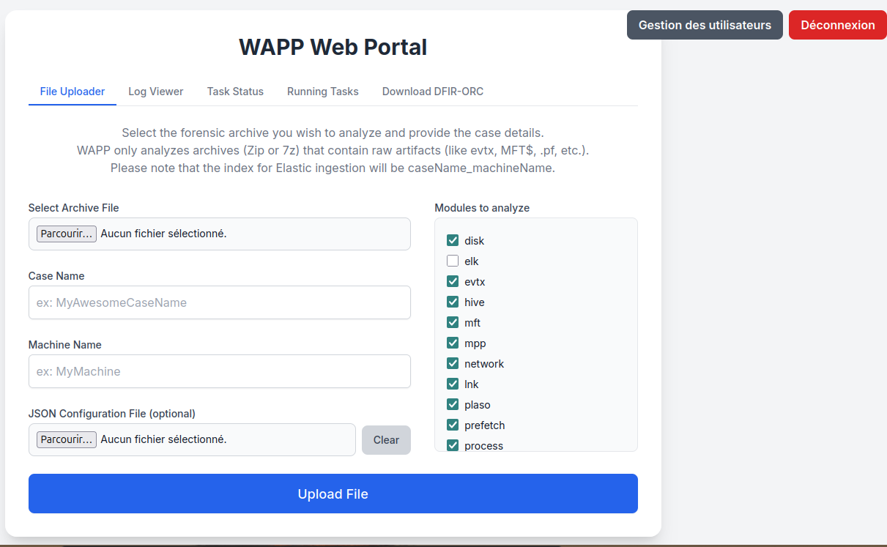

# How to Use WAPP

WAPP is simple to use thanks to its **Web GUI** and **REST API**.  
This guide covers both methods.

---

## 📌 Useful Links

* **WAPP Repository:** [Available here](https://github.com/youhgo/WFAPP)
* **Installation tutorial:** [Installation Guide](https://github.com/youhgo/WFAPP/blob/master/ressources/documentation/how_to_install.md)
* **Results explained:** [Results Architecture](https://github.com/youhgo/WFAPP/blob/master/ressources/documentation/Explaining_the_results.md)
* **DFIR-ORC Configuration:** [Tutorial](https://github.com/youhgo/WFAPP/blob/master/ressources/documentation/configure_orc.md)
---

## 🚀 Using the Web GUI

The default address for the GUI is:

```
https://wapp.localhost/
```

The interface provides **5 tabs**:

- **File Uploader** – Upload an archive you want to parse.  
- **Log Viewer** – Monitor parsing status in real time.  
- **Task Status** – Check the status of a specific task.  
- **Running Tasks** – View all running tasks and stop them if needed.  
- **Download DFIR-ORC** – Download a preconfigured, ready-to-use ORC collector.  

<p align="center">
  
</p>

By uploading an archive, the tool will give you an ID. This id is needed to see the running logs and task status in the other tabs.

---

## ⚡ Using the API

### Parsing an Archive

**Endpoint**  
```
POST /api/parse/parse_archive
```

**Parameters**  
- `file` – Archive file to parse  
- `json` – JSON string with case and machine name  

**Example JSON body:**

```json
{
  "caseName": "name_of_your_case",
  "machineName": "name_of_the_machine_analyzed"
}
```

**Example request with `curl`:**

```bash
curl -X POST -k https://wapp.localhost/api/parse/parse_archive   -F file=@"/path/to/archive.7z"   -F json='{"caseName":"test", "machineName":"DesktopForest"}'
```

**Example response:**

```json
{
  "taskId": "b16b2be6-0c04-4540-96e9-ab922c27b2f7",
  "statusUrl": "/api/get_task_status/b16b2be6-0c04-4540-96e9-ab922c27b2f7",
  "runLogUrl": "/api/running_log/b16b2be6-0c04-4540-96e9-ab922c27b2f7"
}
```

---

### Other API Endpoints

| Endpoint | Method | Description |
|----------|--------|-------------|
| `/` | GET | Health check – returns welcome message and server time |
| `/api/get_task_status/<task_id>` | GET | Get the status and result of a task |
| `/api/running_log/<task_id>` | GET | Get the running log of a task |
| `/api/get_running_tasks` | GET | Get all currently running tasks |
| `/api/stop_task/<task_id>` | POST | Stop a single task by ID |
| `/api/get_running_tasks_parse` | GET | Get only parser-related tasks |
| `/api/get_parser_worker_name` | GET | Get the worker handling parsing tasks |
| `/api/get_worker_details` | GET | Get Celery worker statistics |
| `/api/download/dfir-orc` | GET | Download the DFIR-Orc.exe collector |
| `/api/debug/list_resources` | GET | List contents of the resources directory (debug) |

---

## ✅ Summary

- Use the **Web GUI** for quick interaction and task monitoring.  
- Use the **API** for automation and integration into larger workflows.  
- Always keep track of the `taskId` returned when submitting an archive—it is required to check status, view logs, or stop tasks.  
